# Deepway - AI-Powered Deepfake Detection System

> **Version**: 1.0.0  
> **Last Updated**: January 17, 2026  
> **Author**: Manas Sawant

---

## 📋 Table of Contents

1. [Project Overview](#project-overview)
2. [System Architecture](#system-architecture)
3. [Technology Stack](#technology-stack)
4. [ML Models](#ml-models)
5. [API Endpoints](#api-endpoints)
6. [Data Flow](#data-flow)
7. [Frontend Components](#frontend-components)
8. [Database Schema](#database-schema)
9. [Setup & Deployment](#setup--deployment)

---

## 🎯 Project Overview

**Deepway** is a comprehensive AI-powered media forensics platform that detects deepfakes, AI-generated content, and manipulated media across images, videos, and audio files.

### Key Features

| Feature | Description |
|---------|-------------|
| **Multi-Modal Detection** | Supports images, videos, and audio files |
| **Ensemble AI** | Combines multiple models for robust detection |
| **Real-time Analysis** | Fast inference with ONNX optimization |
| **Forensic Visualization** | ELA plots and frequency spectrum analysis |
| **Cloud AI Integration** | NVIDIA Hive + HuggingFace APIs |
| **Data Persistence** | MongoDB Atlas for storing analysis history |

---

## 🏗️ System Architecture

### High-Level Architecture


### Request Flow


---

## 💻 Technology Stack

### Backend

| Technology | Purpose | Version |
|------------|---------|---------|
| **Python** | Core language | 3.12 |
| **FastAPI** | REST API framework | 0.109+ |
| **PyTorch** | Deep learning | 2.0+ |
| **Transformers** | ViT model loading | 4.40+ |
| **ONNX Runtime** | Optimized inference | 1.17+ |
| **OpenCV** | Image/video processing | 4.9+ |
| **Motor** | Async MongoDB driver | 3.3+ |
| **Uvicorn** | ASGI server | 0.27+ |

### Frontend

| Technology | Purpose | Version |
|------------|---------|---------|
| **React** | UI framework | 18.2 |
| **TypeScript** | Type safety | 5.0+ |
| **Vite** | Build tool | 5.0+ |
| **Tailwind CSS** | Styling | 3.4+ |
| **Framer Motion** | Animations | 11.0+ |
| **Axios** | HTTP client | 1.6+ |
| **Recharts** | Data visualization | 2.12 |

### Infrastructure

| Service | Purpose |
|---------|---------|
| **MongoDB Atlas** | Cloud database |
| **NVIDIA Hive** | Enhanced AI detection |
| **HuggingFace API** | Alternative AI models |

---

## 🤖 ML Models

### 1. Visual Detector (ViT - Vision Transformer)

```mermaid
flowchart LR
    INPUT[Image<br/>224×224] --> PATCH[Patch Embedding<br/>16×16 patches]
    PATCH --> TRANS[Transformer Encoder<br/>12 layers]
    TRANS --> CLS[Classification Head<br/>3 classes]
    CLS --> OUTPUT[Prediction]
    
    style INPUT fill:#e1f5fe
    style OUTPUT fill:#c8e6c9
```



| Property | Value |
|----------|-------|
| **Base Model** | `google/vit-base-patch16-224-in21k` |
| **Fine-tuned On** | Custom deepfake dataset |
| **Input Size** | 224 × 224 × 3 (RGB) |
| **Classes** | Artificial (0), Deepfake (1), Real (2) |
| **File** | `best_deepfake_model.pt` |

**Preprocessing Pipeline:**
```python
1. Resize to 224×224
2. Convert BGR → RGB
3. Normalize: mean=[0.5, 0.5, 0.5], std=[0.5, 0.5, 0.5]
4. Tensor format: [B, C, H, W]
```

### 2. Temporal Detector (3D CNN)

```mermaid
flowchart LR
    VIDEO[Video] --> EXTRACT[Extract 16 Frames]
    EXTRACT --> PREPROCESS[Preprocess<br/>112×112, RGB]
    PREPROCESS --> CNN[3D Convolutions]
    CNN --> POOL[Global Avg Pool]
    POOL --> FC[Fully Connected]
    FC --> OUTPUT[REAL / FAKE]
    
    style VIDEO fill:#fff3e0
    style OUTPUT fill:#c8e6c9
```



| Property | Value |
|----------|-------|
| **Architecture** | SimpleTemporal3D |
| **Input Shape** | (1, 3, 16, 112, 112) = (B, C, T, H, W) |
| **Classes** | REAL (0), FAKE (1) |
| **File** | `Temporal_deepfake_Video.onnx` |

**Preprocessing:**
```python
1. Extract 16 uniformly spaced frames
2. Resize each frame to 112×112
3. Convert BGR → RGB
4. Normalize to [0, 1] (divide by 255)
5. Transpose to (C, T, H, W)
6. Add batch dimension
```

### 3. Forensic Analyzer (Frequency Domain)


| Analysis | Purpose |
|----------|---------|
| **ELA (Error Level Analysis)** | Detects JPEG compression artifacts indicating manipulation |
| **Frequency Spectrum** | Identifies unnatural frequency patterns in AI-generated images |

### 4. Enhanced AI Ensemble


| Model | Weight | API |
|-------|--------|-----|
| NVIDIA Hive | 30% | `ai.api.nvidia.com` |
| HuggingFace | 35% | Inference API |
| Local Ensemble | 35% | ViT + Forensic |

---

## 🌐 API Endpoints

### Standard Analysis

```yaml
POST /api/v1/analyze/image/
  Description: Analyze image for deepfake detection
  Input: multipart/form-data (file)
  Output: ImageAnalysisResponse

POST /api/v1/analyze/video/
  Description: Analyze video with temporal detection
  Input: multipart/form-data (file)
  Query: num_frames (default: 16)
  Output: VideoAnalysisResponse

POST /api/v1/analyze/audio/
  Description: Analyze audio for synthetic voice
  Input: multipart/form-data (file)
  Output: AudioAnalysisResponse
```

### Enhanced Analysis

```yaml
POST /api/v1/analyze/advanced/image/
  Description: Enhanced ensemble (NVIDIA + HF + Local)
  Weights: NVIDIA 30%, HF 35%, Local 35%

POST /api/v1/analyze/advanced/video/
  Description: Enhanced video analysis
  
GET /api/v1/analyze/advanced/status
  Description: Check AI service availability
```

### Response Schema

```json
{
  "analysis_id": "uuid",
  "timestamp": "ISO8601",
  "media_type": "image|video|audio",
  "filename": "example.jpg",
  "classification": "AUTHENTIC|SUSPICIOUS|MANIPULATED",
  "confidence": "LOW|MEDIUM|HIGH",
  "risk_score": 0-100,
  "prediction": {
    "fake_probability": 0.0-1.0,
    "real_probability": 0.0-1.0
  },
  "signals": {
    "local_ensemble": {...},
    "nvidia_hive": {...},
    "huggingface": {...}
  },
  "processing_time_ms": 1234
}
```

---

## 🔄 Data Flow

### Image Analysis Pipeline

```mermaid
flowchart TB
    subgraph Input
        FILE[Upload File]
    end
    
    subgraph Preprocessing
        READ[Read Image]
        READ --> DECODE[Decode to numpy]
        DECODE --> RGB[Convert BGR→RGB]
    end
    
    subgraph Analysis
        RGB --> VIS[Visual Detector]
        RGB --> FOR[Forensic Analyzer]
        VIS --> FUSION
        FOR --> FUSION
    end
    
    subgraph Output
        FUSION --> CLASSIFY[Classification]
        CLASSIFY --> RESPONSE[JSON Response]
    end
    
    subgraph Storage
        FILE --> SAVE_UPLOAD[Save to MongoDB]
        RESPONSE --> SAVE_RESULT[Save Analysis]
    end
    
    FILE --> READ
```



### Video Analysis Pipeline


---

## 🎨 Frontend Components

### Component Architecture


### Key Components

| Component | Purpose |
|-----------|---------|
| `HomePage.tsx` | Landing page with features |
| `AnalyzePage.tsx` | Main analysis interface |
| `Header.tsx` | Navigation with glassmorphic styling |
| `AnimatedOrbs.tsx` | Floating gradient background orbs |
| `FeatureCard.tsx` | Feature showcase cards |
| `StatCard.tsx` | Animated statistics display |
| `AnalysisLoading.tsx` | Loading animation during analysis |

---

## 📊 Database Schema

### MongoDB Collections


---

## 🚀 Setup & Deployment

### Prerequisites

```bash
# Required Software
- Python 3.12+
- Node.js 18+
- MongoDB Atlas account
- NVIDIA API key (optional)
- HuggingFace token (optional)
```

### Backend Setup

```bash
# 1. Create virtual environment
python -m venv .venv
.venv\Scripts\activate  # Windows
source .venv/bin/activate  # Linux/Mac

# 2. Install dependencies
pip install -r requirements.txt

# 3. Configure environment
# Create .env file:
HF_TOKEN="your_huggingface_token"
NVIDIA_API_KEY="your_nvidia_key"
MONGODB_URI="mongodb+srv://..."
MONGODB_DB_NAME="deepway"

# 4. Run server
cd backend
python -m uvicorn app.main:app --reload --port 8000
```

### Frontend Setup

```bash
# 1. Install dependencies
cd frontend
npm install

# 2. Start dev server
npm run dev

# 3. Build for production
npm run build
```

### Directory Structure

```
Deepway/
├── backend/
│   ├── app/
│   │   ├── api/           # API endpoints
│   │   │   ├── image.py
│   │   │   ├── video.py
│   │   │   ├── audio.py
│   │   │   └── advanced.py
│   │   ├── services/      # Detection services
│   │   │   ├── visual_detector.py
│   │   │   ├── temporal_detector.py
│   │   │   ├── forensic_analyzer.py
│   │   │   ├── fusion_engine.py
│   │   │   └── nvidia_hive.py
│   │   ├── database/      # MongoDB integration
│   │   │   ├── connection.py
│   │   │   └── storage.py
│   │   ├── models/        # Pydantic schemas
│   │   └── main.py        # FastAPI app
│   └── requirements.txt
├── frontend/
│   ├── src/
│   │   ├── pages/
│   │   ├── components/
│   │   ├── services/
│   │   └── styles/
│   └── package.json
├── Models/                # ML model files
│   ├── best_deepfake_model.pt
│   ├── Temporal_deepfake_Video.onnx
│   └── deepfake_3dcnn_final1.onnx.data
└── data/                  # Uploaded files
    └── uploads/
```

---

## 📈 Performance Metrics

| Metric | Value |
|--------|-------|
| Image Analysis Time | < 1 second |
| Video Analysis Time | 3-10 seconds (16 frames) |
| ViT Model Accuracy | ~94% (on test set) |
| Temporal CNN Accuracy | ~89% (on test set) |

---

## 🔐 Security

- API keys stored in environment variables
- CORS configured for development
- MongoDB connection uses TLS
- File uploads validated by type and size
- Temp files cleaned after processing

---

## 📜 License

This project is proprietary. All rights reserved.

---

*Documentation generated for Deepway Deepfake Detection System*
