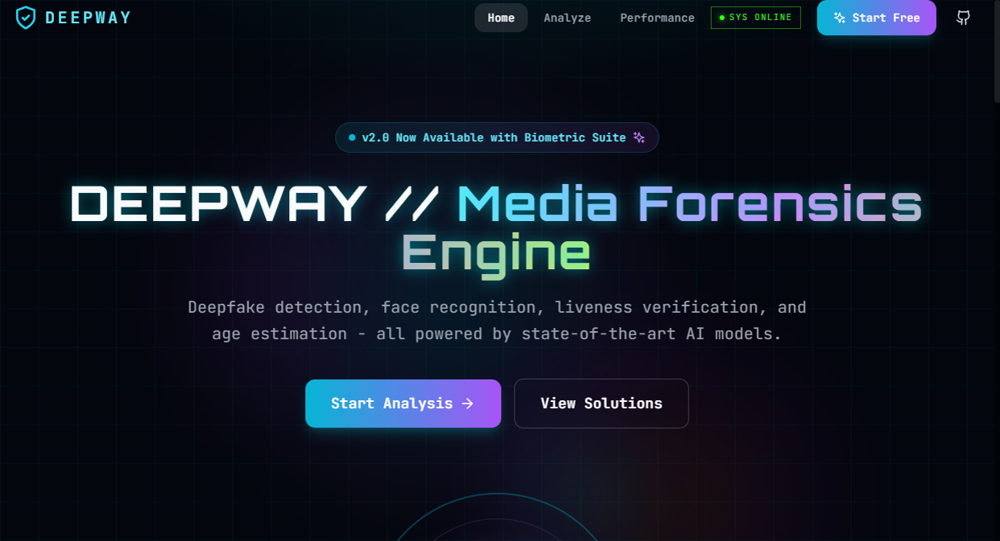
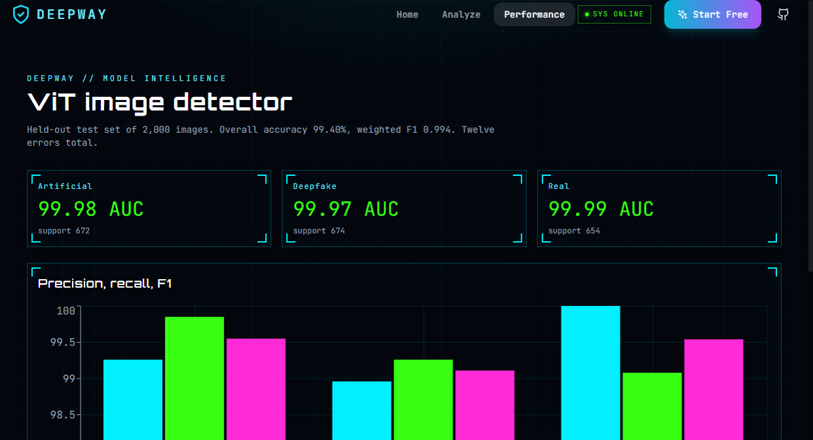
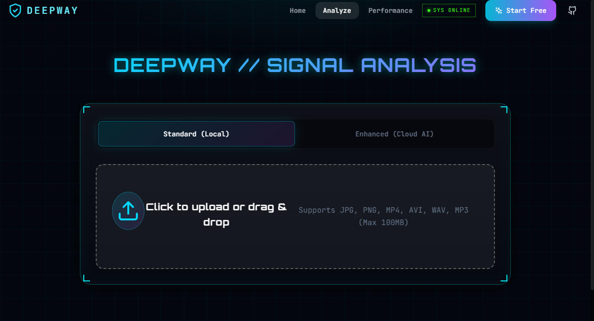
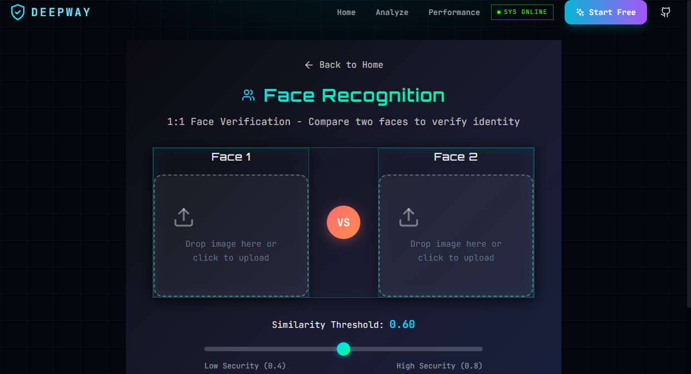
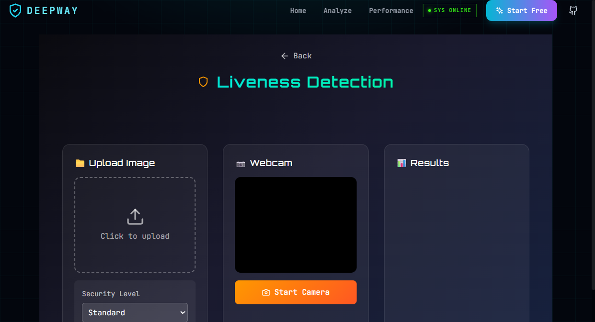
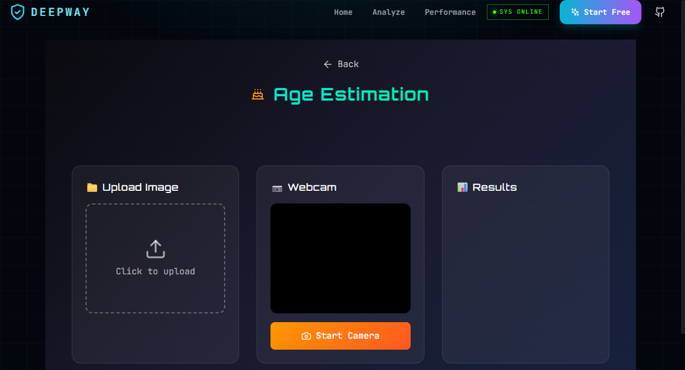

# Deepway

Media forensics for images, video, and voice. Deepway scores a file as authentic, suspicious, or manipulated, then shows the forensic evidence behind that score.



The image detector is a fine-tuned ViT-Base/16. On a held-out set of 2,000 images it reached **99.40% accuracy**, weighted F1 **0.994**, and ROC-AUC **0.9997–0.9999** per class. Twelve images were wrong. Full tables and charts are in [docs/RESULTS.md](docs/RESULTS.md).



## What it does

| Engine | Input | How it decides |
| --- | --- | --- |
| Visual | Image or video frame | ViT-Base/16, three classes: Artificial, Deepfake, Real |
| Forensic | Image | SRM high-pass front-end plus EfficientNet-B4, plus ELA and a frequency spectrum |
| Temporal | Video | 3D CNN over 16 frames |
| Audio | Wav or the track inside a video | Mel-spectrogram CNN |
| Biometrics | Face images | Match, liveness, and age |

A fusion step turns those signals into one risk score from 0 to 100.

- **0–39** authentic
- **40–69** suspicious
- **70–100** manipulated

Optional cloud engines (NVIDIA Hive, Hugging Face) run only when their API keys are set. MongoDB is optional. The API still answers without either.

## Screens









## Results


| Class | Accuracy | F1 | ROC-AUC | Support |
| --- | --- | --- | --- | --- |
| Artificial | 99.85% | 0.9955 | 0.9998 | 672 |
| Deepfake | 99.26% | 0.9911 | 0.9997 | 674 |
| Real | 99.08% | 0.9954 | 0.9999 | 654 |

The forensic model’s validation accuracy stays near 99% on its training curves. Heavy JPEG compression removes the high-frequency cues it uses, so the ViT score should weigh more on social-media images. Audio and temporal models run in the app; this repo does not quote a held-out accuracy for them.

Training plots (no sample faces) live in [docs/assets/plots](docs/assets/plots).

## Run it

Weights are not in git. Put the files listed in [Models/README.md](Models/README.md) into `Models/`.

```powershell
# Windows
cd backend
copy .env.example .env
cd ..
.\.venv\Scripts\python.exe -m uvicorn app.main:app --app-dir backend --host 127.0.0.1 --port 8000
```

```bash
# macOS or Linux
cd backend && cp .env.example .env && cd ..
python -m uvicorn app.main:app --app-dir backend --host 127.0.0.1 --port 8000
```

```bash
cd frontend
npm install
npm run dev
```

Open `http://127.0.0.1:5173`. API docs are at `http://127.0.0.1:8000/docs`.

Python dependencies are in `backend/requirements.txt`. The frontend is React, TypeScript, and Vite.

## API

| Method | Path | Purpose |
| --- | --- | --- |
| GET | `/health` | Which local engines loaded |
| POST | `/api/v1/analyze/image/` | Image analysis |
| POST | `/api/v1/analyze/video/` | Video analysis |
| POST | `/api/v1/analyze/audio/` | Voice analysis |
| GET | `/api/v1/analyze/advanced/status` | Cloud engines |
| POST | `/api/v1/analyze/face/detect` | Face detection |
| POST | `/api/v1/analyze/liveness/detect` | Liveness |
| POST | `/api/v1/analyze/age/estimate` | Age |
| POST | `/api/v1/analyze/report/from-json` | PDF report |

```json
{
  "classification": "SUSPICIOUS",
  "confidence": "MEDIUM",
  "risk_score": 55.42,
  "prediction": { "fake_probability": 0.5542, "real_probability": 0.4458 }
}
```

## Layout

```
backend/     FastAPI app
frontend/    React HUD
Models/      local weights (not committed)
docs/        results, plots, screenshots
tools/       ONNX export scripts
```

## Responsible use

Deepway is a research forensics tool. A score is not legal proof that a file is real or fake. Do not use it to harass anyone or to process media you are not allowed to have.

## Author

Manas Sawant

- [LinkedIn](https://www.linkedin.com/in/manas-sawant-7b1332283/)
- [GitHub](https://github.com/Monike123/Deepway)
- manassawan5913@gmail.com
