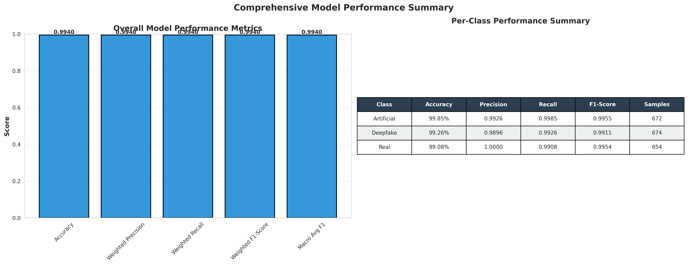
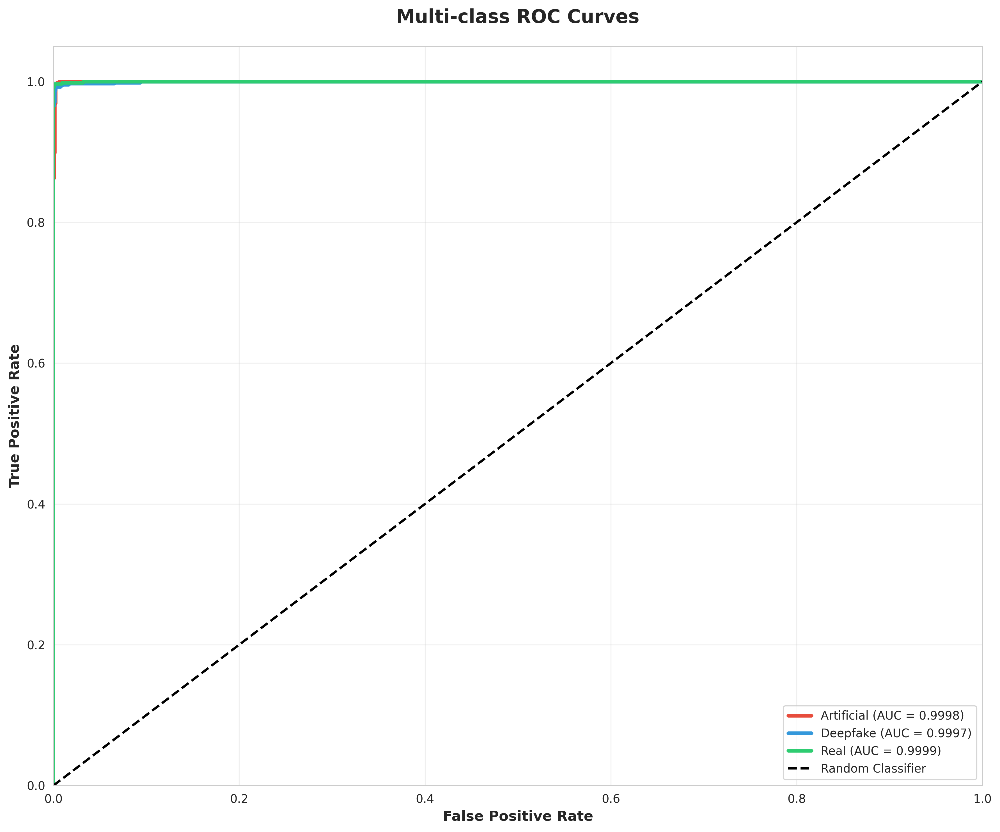
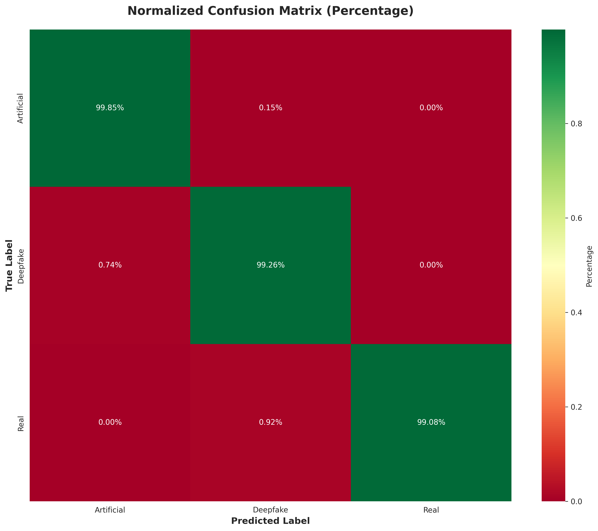
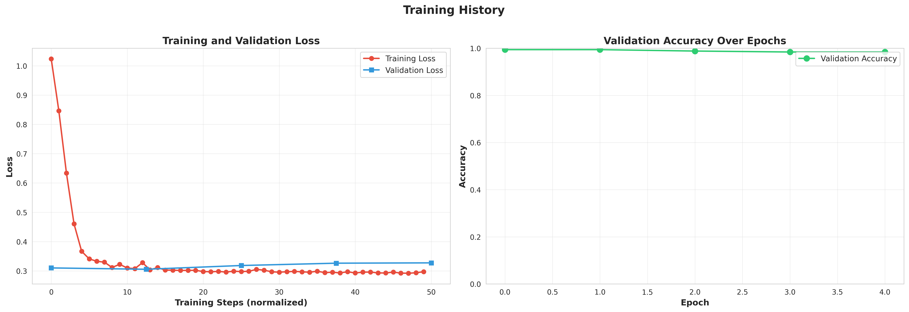
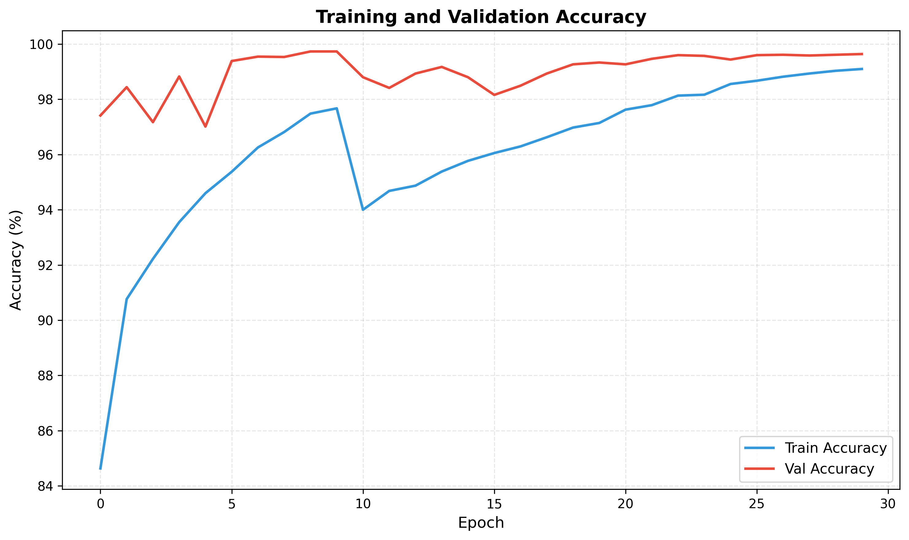
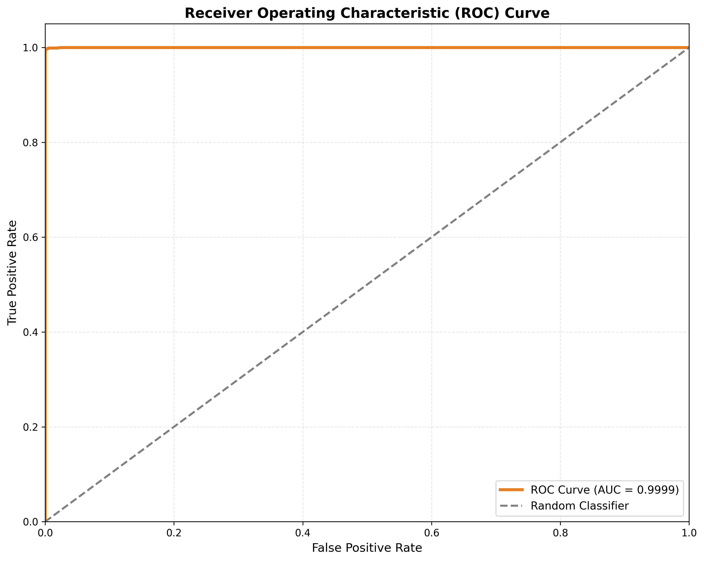
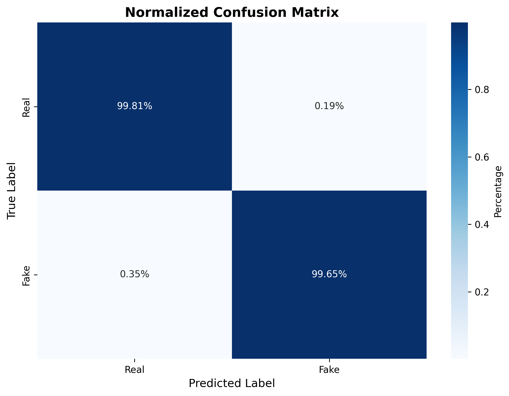

# Deepway results

Numbers below come from the held-out evaluation report for the image detector and from the forensic training curves. Sample-face error grids are not included.

## Image detector (ViT-Base/16)

Fine-tuned from `google/vit-base-patch16-224-in21k` on three classes: Artificial, Deepfake, Real.

Test set: 2,000 images.

| Metric | Score |
| --- | --- |
| Accuracy | 0.9940 |
| Weighted precision | 0.9940 |
| Weighted recall | 0.9940 |
| Weighted F1 | 0.9940 |
| Macro F1 | 0.9940 |

| Class | Accuracy | Precision | Recall | F1 | Support | ROC-AUC |
| --- | --- | --- | --- | --- | --- | --- |
| Artificial | 0.9985 | 0.9926 | 0.9985 | 0.9955 | 672 | 0.9998 |
| Deepfake | 0.9926 | 0.9896 | 0.9926 | 0.9911 | 674 | 0.9997 |
| Real | 0.9908 | 1.0000 | 0.9908 | 0.9954 | 654 | 0.9999 |

Confusion matrix (rows are true labels):

|  | Artificial | Deepfake | Real |
| --- | --- | --- | --- |
| Artificial | 671 | 1 | 0 |
| Deepfake | 5 | 669 | 0 |
| Real | 0 | 6 | 648 |

Twelve mistakes in 2,000 images. The hardest boundary is Real versus Deepfake.

Training: learning rate 1e-5, batch size 16, 5 epochs, weight decay 0.1, label smoothing 0.1. Average confidence on correct predictions was 0.932. Confidence on the few mistakes was still high (0.746), so the report recommends a bit more regularization.

## Forensic detector (SRM + EfficientNet-B4)

The checkpoint `forensic_best.pth` is an EfficientNet-B4 with a 5x5 SRM front-end, 6-channel stem, GeM pooling, and a binary head. The plotted validation accuracy stays above about 98% after the early epochs and finishes near 99.6%. Training accuracy finishes near 99.1%.

Heavy JPEG compression removes the high-frequency cues this model uses. On compressed social-media images, the ViT score should carry more weight.

## What is not claimed

Audio and temporal video checkpoints ship with the app and run locally. This page does not quote an accuracy for them, because this repository does not contain a held-out numeric report for those two models.
